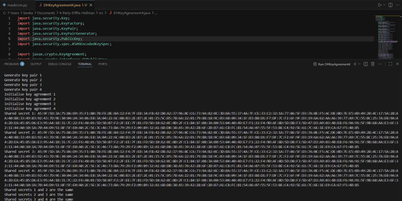
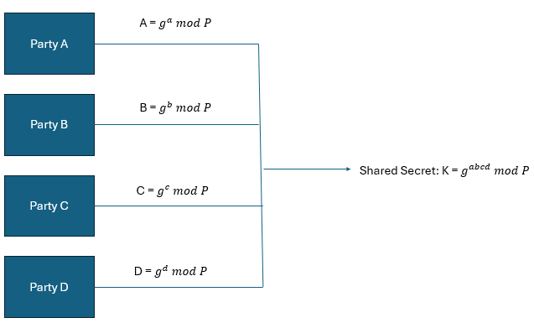

# Four-Party-Diffie-Hellman-Key-Exchange

Overview:
This project implements an extended version of the Diffie-Hellman key exchange protocol to support secure key establishment between four participants. This demonstrates how public and private values are exchanged in order to produce a common shared secret, while avoiding actually transmitting the secret itself.

It was developed to explore the cyrptographic protocol design, and the principles behind communicating securely.

Features:
- Four-party key exchange implementation
- Shared secret derivation
- Secure key establishment, and demonstration

Technologies Used:
- Java
- Object-Oriented Programming
- Cryptography

Screenshots:

Protocol Execution:

Four-Party Exchange Diagram:

Illustration of a four-party Diffie-Hellman key exchange, having each participant contribute their public value, in order to derive the common shared secret.

How to Run:
1: Compile: javac DHKeyAgreement4.java
2: Run: java DHKeyAgreement4

Author:
- This was developed by Benjamin Kay as part of university coursework, focusing on exploring cryptographic protocols and secure mechanisms for key exchange.
